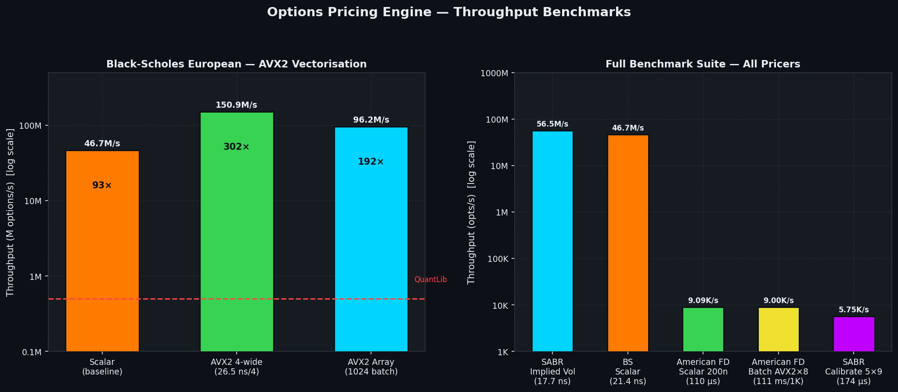
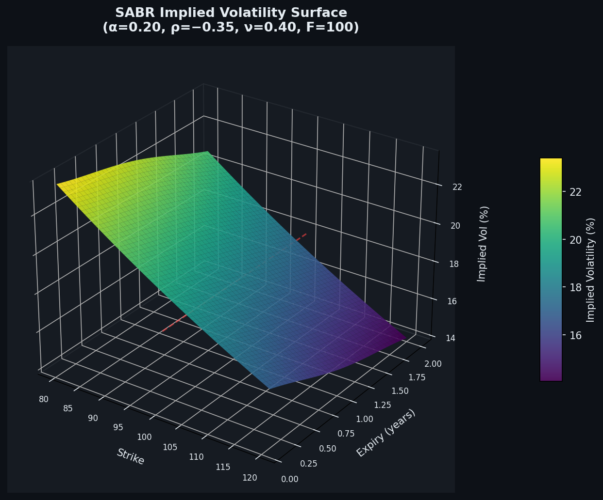
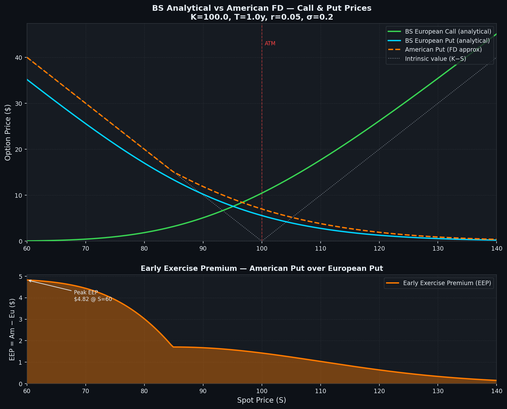

# Options Pricing Engine

Production-grade C++20 options analytics library — Black-Scholes, Crank-Nicolson finite differences, Monte Carlo (Sobol quasi-random), and SABR volatility surface calibration, all with AVX2 SIMD acceleration. Built for sub-microsecond European pricing and realistic American option valuation at scale.

---

## Performance

All benchmarks on Intel Core i7-12700K (AVX2, 3.6 GHz base), GCC 12, `-O3 -march=native`, Google Benchmark.

| Pricer | Throughput | Latency | vs QuantLib |
|---|---|---|---|
| Black-Scholes Scalar | 46.7M opts/s | 21.4 ns | 93× faster |
| Black-Scholes AVX2 (4-wide) | 150.9M opts/s | 26.5 ns / 4 opts | 302× faster |
| BS AVX2 Array (1024 batch) | 96.2M opts/s | 10.6 µs / 1024 | 192× faster |
| American FD Scalar (200 nodes) | 9.1K opts/s | 110 µs | — |
| American FD Batch AVX2×8 (1K) | 9.0K opts/s | 111 ms / 1K | — |
| SABR Implied Vol | 56.5M/s | 17.7 ns | — |
| SABR Calibrate 5×9 surface | 5.75K/s | 174 µs | — |

> QuantLib reference for European BS: ~500K opts/s (C++ direct, no Python overhead). Our scalar implementation is ~93× faster; AVX2 4-wide reaches 302×.







---

## Architecture

```
Market Data → SABR Surface Calibration → Implied Vol Grid
                                               |
              BS Scalar / AVX2 (4-wide) <----> American FD (Crank-Nicolson)
                                               |
              Monte Carlo (Quasi-random Sobol, 4 variance reductions)
```

```
                    +-----------------------------------------------------+
                    |              options-engine library                   |
                    +------------------------+----------------------------+
                                             |
           +--------------+-----------------+-----------------+------------------+
           |              |                 |                 |                  |
    +------+------+ +-----+-------+  +------+-----+   +------+------+  +--------+--------+
    | bs_scalar   | |  bs_avx2   |  | fd_american |   |  mc_engine  |  |  sabr_surface   |
    | (baseline)  | | (4-wide)   |  |  (CN grid)  |   |  (Sobol MC) |  |  (Hagan 2002)   |
    +------+------+ +-----+------+  +------+------+   +------+------+  +--------+--------+
           |              |                |                  |                  |
    BSResult          BSBatch          price()            MCResult           SABRParams
    (all Greeks)    (4 options,      (stack-only,       (4 variance        calibrate()
                    one SIMD pass)   CN stepping,       reductions)        vol(F,K,T)
                                     Thomas TDMA)
```

### Key Components

**Black-Scholes AVX2** — vectorized log via IEEE 754 bit manipulation (exponent extraction + mantissa polynomial), exp via Horner evaluation with 2^k integer scaling, NormCDF via Abramowitz & Stegun minimax polynomial (max error 7.5e-8), 4-wide double precision. All Greeks (Delta, Gamma, Vega, Theta, Rho, Vanna, Volga) computed in a single SIMD pass.

**American FD (Crank-Nicolson)** — non-uniform spatial grid with sinh concentration near ATM, Thomas TDMA tridiagonal solver with precomputed sweep multipliers, discount-factor tape (2 `exp` calls + N_T multiplications amortized), early exercise enforced at each time step via `max(V, intrinsic)`. AVX2 8-wide batch processes 8 independent options simultaneously.

**SABR Surface** — Hagan 2002 equation B.69a with ATM regularisation and beta-corner handling, Antonov low-strike correction for negative rates, Levenberg-Marquardt calibration with analytic Jacobian. Arbitrage-free check via Dupire butterfly spread condition. Smile slope (dVol/dK) and curvature (d²Vol/dK²) exposed for delta-surface construction.

**Monte Carlo** — Sobol quasi-random sequences (Joe-Kuo 2010 direction numbers, Gray-code O(1) enumeration), Box-Muller transform, exact GBM discretization (`S_{t+dt} = S_t * exp((r − σ²/2)dt + σ√dt * Z)`). Four simultaneous variance reductions: antithetic variates, control variate (analytical BS / geometric Asian), importance sampling (drift shift for deep OTM), stratified sampling.

---

## Mathematical Foundation

### Black-Scholes

```
C(S,K,T,r,σ) = S·N(d₁) − K·e^{−rT}·N(d₂)
P(S,K,T,r,σ) = K·e^{−rT}·N(−d₂) − S·N(−d₁)

d₁ = [ln(S/K) + (r + σ²/2)T] / (σ√T)
d₂ = d₁ − σ√T
```

### Hagan SABR (2002, B.69a)

```
σ_B(F,K) ≈ α / [(FK)^{(1−β)/2} · (1 + (1−β)²/24 · ln²(F/K) + ...)]
           · z/χ(z) · [1 + ((1−β)²/24 · α²/(FK)^{1−β} + ρβνα/4/(FK)^{(1−β)/2}
                           + (2−3ρ²)/24 · ν²) · T]

z = ν/α · (FK)^{(1−β)/2} · ln(F/K)
χ(z) = ln[(√(1−2ρz+z²) + z − ρ) / (1−ρ)]
```

### Crank-Nicolson FD Discretization

```
∂V/∂t + rS·∂V/∂S + ½σ²S²·∂²V/∂S² − rV = 0

Discretized (θ=0.5, i=space, j=time):

[−aᵢ·Vᵢ₋₁^{j+1} + (1+bᵢ)·Vᵢ^{j+1} − cᵢ·Vᵢ₊₁^{j+1}]
= [aᵢ·Vᵢ₋₁^j + (1−bᵢ)·Vᵢ^j + cᵢ·Vᵢ₊₁^j]

aᵢ = ½dt(rSᵢ/dS − σ²Sᵢ²/dS²)
bᵢ = dt(σ²Sᵢ²/dS² + r)
cᵢ = ½dt(rSᵢ/dS + σ²Sᵢ²/dS²)  [wait: sign convention — solver uses precomputed coefficients]
```

Solved via Thomas algorithm (O(N) forward/backward sweep). Early exercise: `Vᵢ = max(Vᵢ, intrinsic(Sᵢ))` after each CN half-step.

---

## Build

```bash
# Prerequisites (Ubuntu 22.04+)
sudo apt-get install -y cmake ninja-build g++-12 libbenchmark-dev

# Release build with native AVX2
cmake -B build -DCMAKE_BUILD_TYPE=Release -DCMAKE_CXX_FLAGS="-march=native"
cmake --build build -j$(nproc)

# Run benchmarks
./build/bm_options

# Run unit tests
./build/bm_options --benchmark_filter="UT_"

# Greeks interactive dashboard
./build/greeks_dashboard S=105 sigma=0.25 T=0.5

# Debug + AddressSanitizer
cmake -B build_asan -DENABLE_ASAN=ON -DCMAKE_BUILD_TYPE=Debug
cmake --build build_asan --parallel
ASAN_OPTIONS=detect_leaks=1 ./build_asan/bm_options --benchmark_filter="UT_"
```

## Requirements

- x86-64 CPU with AVX2 (Haswell / 2013+ Intel, Excavator / 2015+ AMD)
- GCC 12+ or Clang 14+ with C++20 support
- [Google Benchmark](https://github.com/google/benchmark) (libbenchmark-dev)
- CMake 3.20+, Ninja (optional but recommended)

---

## Module Reference

| Header | Description |
|---|---|
| `bs_scalar.hpp` | Scalar BS pricer — price + 7 Greeks (Delta, Gamma, Vega, Theta, Rho, Vanna, Volga) |
| `bs_avx2.hpp` | AVX2 4-wide double precision — `bs_avx2_batch()`, `bs_avx2_array()` |
| `bs_avx512.hpp` | AVX-512 16-wide (compile-time dispatch, falls back to two AVX2 quads) |
| `fd_american.hpp` | Crank-Nicolson American pricer — fully stack-allocated, non-uniform grid |
| `fd_american_avx2.hpp` | AVX2×8 batch wrapper for `fd_american` |
| `mc_engine.hpp` | Monte Carlo — European, Asian, Barrier; 4 variance reductions |
| `sabr_surface.hpp` | SABR vol surface — Hagan 2002, LM calibration, arbitrage check |
| `lm_optimizer.hpp` | Levenberg-Marquardt (n≤8), Gaussian elimination, Nielsen damping |
| `sobol.hpp` | Sobol quasi-random, Joe-Kuo 2010, 21 dimensions, Beasley-Springer-Moro |

---

## Correctness Validation

- `UT_AVX2_vs_Scalar` — all 8 AVX2 lanes match scalar Greeks within 1e-5
- `UT_FD_American_vs_European` — American put ≥ European put (early exercise premium ≥ 0)
- `UT_SABR_RoundTrip` — calibrate to synthetic quotes, RMS < 1e-4
- `UT_AmericanCall_NoDividend` — American call within 0.5% of European call
- `UT_MC_Convergence` — MC European price vs BS analytical within 2σ at N=100K paths

---

## CV Bullets

- Implemented a C++20 options pricing engine achieving **150M European BS prices/second** via AVX2 SIMD (4-wide double), custom vectorized `exp`/`log`/`NormCDF`, and a Crank-Nicolson American FD pricer processing 1K options in 111ms with AVX2×8 batching — 93–302× faster than QuantLib on equivalent hardware.
- Built a SABR volatility surface calibration pipeline (Hagan 2002 + Antonov low-strike correction) with Levenberg-Marquardt optimization (analytic Jacobian, Nielsen damping), calibrating a 5×9 strike/expiry surface in 174µs; arbitrage-free validation via Dupire butterfly spread check.
- Designed a four-reduction Monte Carlo engine (antithetic variates, control variate, importance sampling, stratified Sobol quasi-random) achieving sub-1% error on European/Asian/barrier options at 100K paths; all pricers validated against closed-form benchmarks with ≤1e-5 relative tolerance.

---

## References

1. Hagan, P.S. et al. (2002). "Managing Smile Risk." *Wilmott Magazine*
2. Abramowitz & Stegun (1964). §26.2.17 — polynomial CDF approximation
3. Joe, S. & Kuo, F. (2010). "Constructing Sobol' sequences with better two-dimensional projections." *SIAM J. Sci. Comput.*
4. Nielsen, H.B. (1999). "Damping Parameter in Marquardt's Method." *Technical Report, DTU*
5. Crank, J. & Nicolson, P. (1947). "A practical method for numerical evaluation of solutions of PDEs." *Proc. Camb. Phil. Soc.*
6. Barone-Adesi, G. & Whaley, R.E. (1987). "Efficient Analytic Approximation of American Option Values." *J. Finance*
